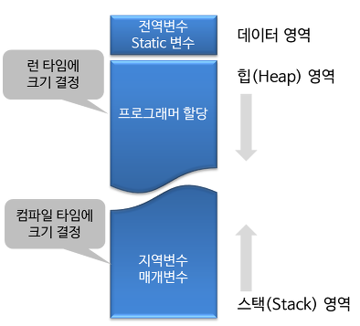

> https://dsnight.tistory.com/50 출처

#### C언어의 메모리 구조

프로그램을 실행시키면 운영체제는 우리가 실행시킨 프로그램을 위해 메모리 공간을 할당해준다. 

할당되는 메모리 공간은 크게 **스택(Stack), 힙(Heap), 데이터(Data)**영역으로 나뉘어진다. 

이러한 메모리 공간이 어떠한 용도로 언제, 어디서 할당되는지 알아보도록 하자.


할당 시기 : 프로그램이 실행될 때마다

할당 장소 : 메인 메모리(RAM)

할당 용도 : 프로그램 실행 시 필요한 메모리 공간(지역변수, 전역변수 선언을 위해) 할당



**데이터(Data) 영역**

 \- 전역 변수와 static 변수가 할당되는 영역

 \- 프로그램의 시작과 동시에 할당되고, 프로그램이 종료되어야 메모리에서 소멸됨 

```c
#include <stdio.h>

int a = 10;	// 데이터 영역에 할당
int b = 20;	// 데이터 영역에 할당

int main() {

	...

	return 0;
}
```

위와 같은 코드에서 int형 변수 **a**, **b**는 프로그램 실행시, **main 함수**가 호출되기 전에 데이터 영역에 할당된다.

그렇기 때문에 프로그램이 종료될 때까지 메모리상에 존재한다.

(전역변수가 프로그램이 종료될 때 까지 존재하는 이유)


**스택(Stack) 영역**


 \- 함수 호출 시 생성되는 지역 변수와 매개 변수가 저장되는 영역

 \- 함수 호출이 완료되면 사라짐

 

```c
#include <stdio.h>

void fct1(int);
void fct2(int);

int a = 10;	// 데이터 영역에 할당
int b = 20;	// 데이터 영역에 할당

int main() {

	int i = 100;	// 지역변수 i가 스택 영역에 할당

	fct1(i);
	fct2(i);

	return 0;
}

void fct1(int c) {
	int d = 30;	// 매개변수 c와 지역변수 d가 스택영역에 할당
}

void fct2(int e) {
	int f = 40;	// 매개변수 e와 지역변수 f가 스택영역에 할당
}
```

**main함수**와 **fct1**, **fct2**라는 함수를 추가하였다. 

**a**, **b**를 데이터 영역에 할당한 뒤에 **main함수**를 호출하면서 int형 변수 **i**는 지역변수로서 스택영역에 할당된다.

그 뒤에 **fct1()**이라는 함수를 호출하면서 **fct1함수**의 매개변수인 **c**와 **d**가 스택영역에 할당된다.

**fct1()**이라는 함수호출이 끝나면 **c**와 **d**는 스택영역에서 삭제되며, 

그 뒤 **fct2()**라는 함수를 호출하면서 매개변수 **e**와 지역변수 **f**가 스택영역에 할당된다.

스택영역은 그 이름그대로 스택의 성질을 띄고있다.


**힙(Heap) 영역**


 \- 필요에 의해 동적으로 메모리를 할당 할 때 사용


지금까지 데이터영역과 스택영역을 알아보았는데, 저 두가지 영역만 있으면 코드를 문제없이 짤 수 있을것 처럼 보인다.

그럼 힙영역은 왜 필요한 것일까?


**힙 영역은 왜 필요할까?**

제일 첫번째 그림을 보면 힙 영역은 프로그래머가 할당한다고 되어있다. 

그럼 언제 할당을 할까? 

배열을 예를들어서 설명을 하겠다.


우리는 배열을 선언할때 상수로 선언을 한다.

```
int main() {

	// 정상적인 배열선언
	int arr[10];

	// 비 정상적인 배열선언
	int i = 0;
	scanf("%d", &i);
	int arr[i];

	return 0;
}
```

배열의 길이를 사용자가 입력한 숫자로 잡아주는 것은 비 정상적인 배열선언이다. 왜 비 정상적일까?

메모리 구조에 대해서 잘 파악하고 있다면 당연한 이야기다.


제일 첫번째 그림을 다시보자, 스택 영역에 할당될 메모리의 크기는 컴파일 타임(컴파일 하는 동안)에 결정된다고 되어있다.

정상적인 배열 선언의 경우 **arr**이라는 배열의 크기가 **40바이트** 라는것을 알 수 있다.

하지만 비 정상적인 배열선언의 경우 **i**의 크기가 **4바이트** 라는 것을 알 수 는 있으나, **arr**이라는 배열의 크기는 알 수 없다.


그렇다면 다음과 같이 배열을 선언할 때는 문제가 없을까?

```
int main() {
	
	int i = 10;
	int arr[i];

	return 0;
}
```

**i** 라는 변수가 **10**이기 때문에 **arr**이라는 배열의 크기가 **10**이라는 것을 알 수 있지 않을까?

결과는 아니다.


컴파일을 하는 동안 **i**가 **4바이트**의 크기라는 것을 알 수는 있으나, 그 값이 **10**으로 초기화 되었다는 사실은 무시하고 넘어간다. 값이 **10**으로 초기화 되었다는 사실은 실행되는 동안, 즉 런타임에 결정된다.

그렇기 때문에 컴파일러는 **arr**의 크기가 **40바이트**가 된다는 사실을 알 수 없다. 


사용자의 요구에 맞게 메모리를 할당해 주기 위해서는(런타임에 메모리 크기를 결정하고 싶을 때) 메모리 동적 할당을 통해 힙 영역에 메모리를 할당해야 한다.


**힙 영역 : 할당해야 할 메모리의 크기를 프로그램이 실행되는 동안 결정해야 하는 경우(런 타임때) 유용하게 사용되는 공간**


힙 영역을 사용하기 위해서는 동적할당에 대해서 공부하여야 한다.

